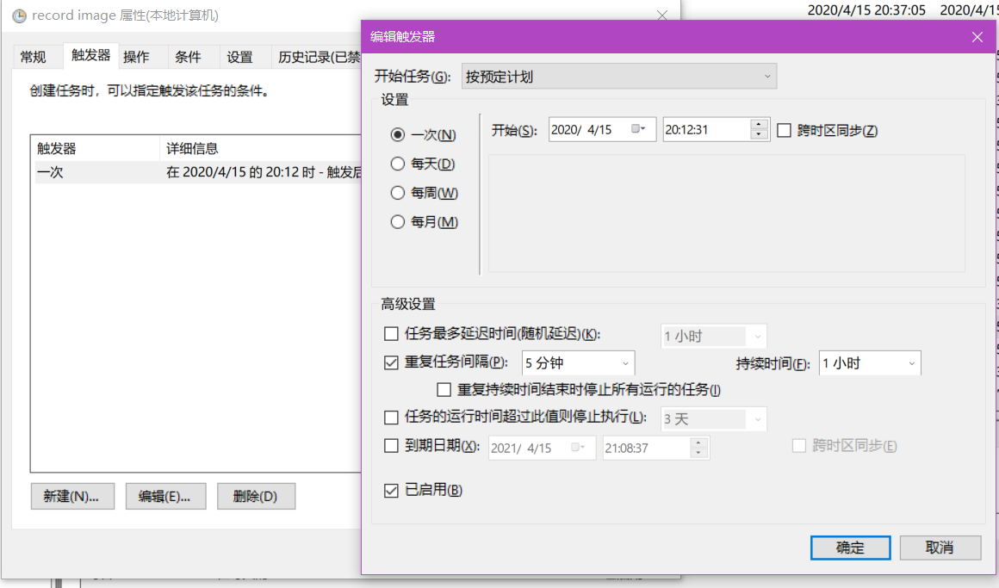

Backdoor for screenshot

没有弹窗，完全无感的定时截屏后门

得益于 go ~~优雅~~ 的交叉编译的特点，程序适用于各个平台

# 用法

1. 放置该文件夹到任意目录，删除其他文件，只保留`chunchun.exe`和`record.vbs`
2. 添加定时任务，选择执行的程序为文件夹内的record.vbs，设定执行计划为执行一次，勾选重复任务间隔，设定为五分钟，持续时间无限期
3. 截屏图片会保存到当前目录

可以运行`go build`自行编译二进制文件，也可直接使用编译好的exe

# 注意
本人不对滥用此程序造成的后果负责。

请勿将其用于非法用途，仅作为技术研究目的。

Les1ie

2020-4-15 21:56:48
